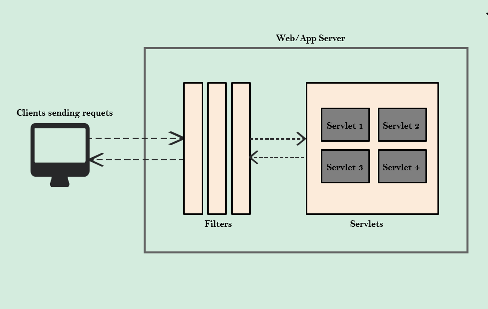
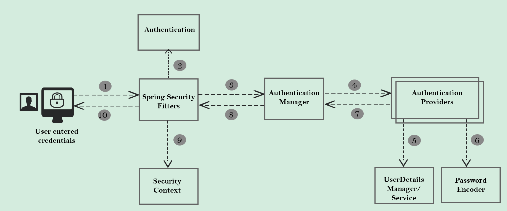

# spring-security
Spring security learning module

Spring Security is built by a team at Spring who are expert of security by considering all possible scenarios.

Spring security handles common security vulnerabilities like CSRF, CORs etc. For any security vulnerabilities identified, the framework will be patched immediately.

Filters inside Java Web Applications can be used to intercept each request/response and do some pre work before our business logic. Using the same filters, Spring security enforce security based on our configuration inside web application. 

# Spring Security internal flow

## Spring Security Filters

A series of Spring Security filters intercept each request & work together to identify if Authentication is required or not. If authentication is required, accordingly naviagte the user to login page or use the existing details stored during intial authentication.

## Authentication

Filters like UsernamePasswordAuthenticationFilter will extract username / password from HTTP request & prepare Authentication type object. Because Authentication is the core standard of storing authenticated user details inside Spring Security framework.

## Authentication Manager

Once received request from filter, it delegates the validating of the user details to the authentication providers available. Since there can be multiple providers inside an app, it is the responsiblity of the Authentication Manager to manage all the authentication providers available.

## Authentication Provider

AuthenticationProviders has all the core logic of validating user details for authentication.

## UserDetailsManager/UserDetailsService

UserDetailsManager/UserDetailsService helps in retrieving, creating, updating and deleting the User Details from the DB/storage system.

## PasswordEncoder

Service interface that helps in encoding & hashing passwords. Oherwise we may have to live with plain text passwords.

## SecurityContext

Once the request has been authenticated, the Authentication will usually be stored in a thread-local SecurityContext managed by the SecurityContextHolder. This helps during the upcoming requests from the same user.